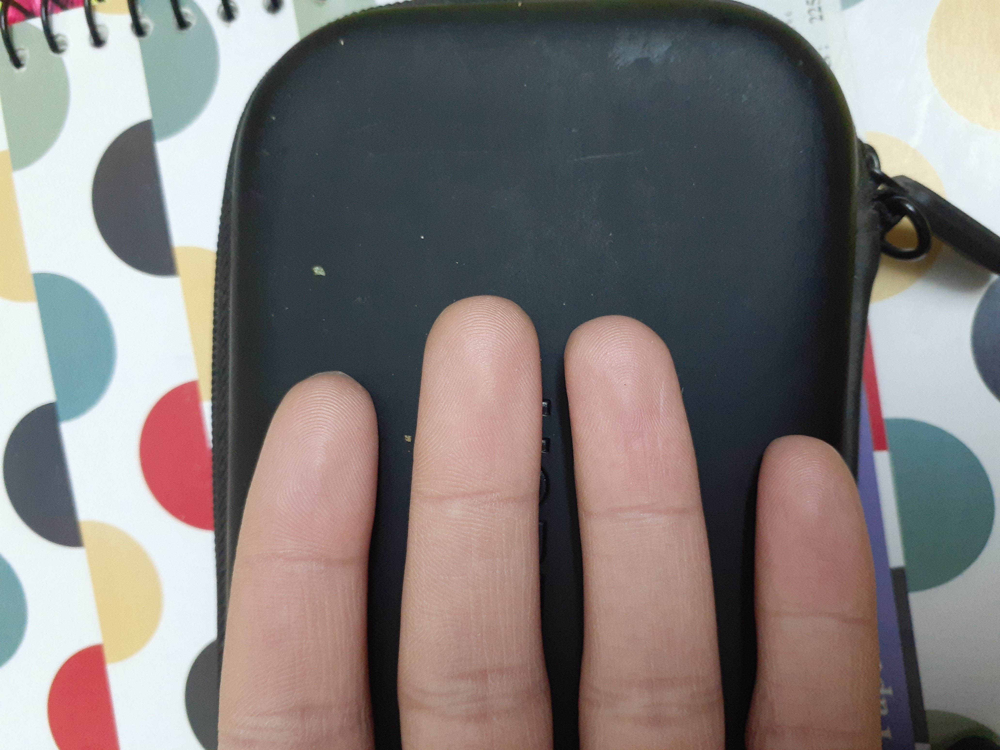
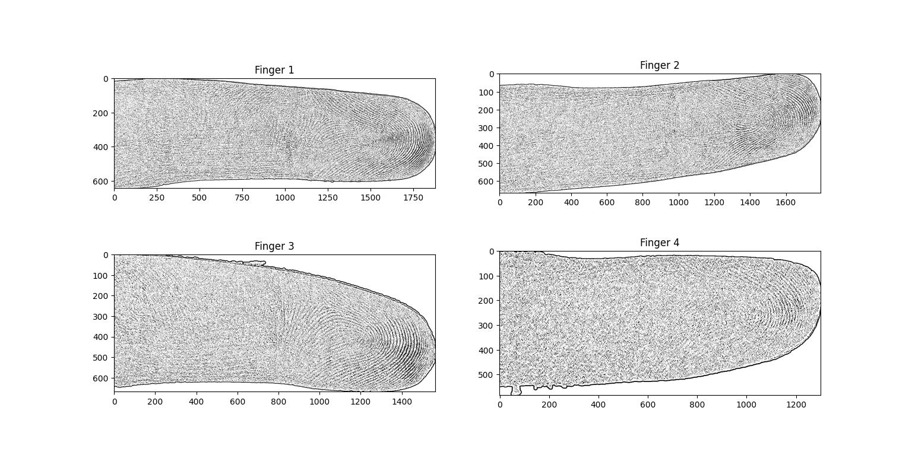

# Fingerprint Extraction using OpenCV

This project aims to extract the fingerprints from an image of a hand using OpenCV. The program is capable of detecting the four fingers from the image and processing each finger to extract its unique fingerprint. 

## Prerequisites
- Python 3.x
- OpenCV 4.x
- Numpy

## Installation

To install the dependencies, run the following command:

``` bash
pip install opencv-python numpy
```

## Usage

The program can be executed using the following command:

``` bash
python fingerprint_extraction.py <path_to_image>
```

where `<path_to_image>` is the path to the image file that you want to process. The extracted fingerprints will be displayed on the screen.

## Sample Input

The input should look something like this:



## Results

The program will display the original image and the extracted fingerprints. The output should look something like this:



## Contributing

If you wish to contribute to this project, please follow these steps:

1. Fork this repository
2. Clone the forked repository to your local machine
3. Create a new branch for your changes
4. Commit your changes and push to the new branch
5. Create a pull request to merge your changes into the master branch

